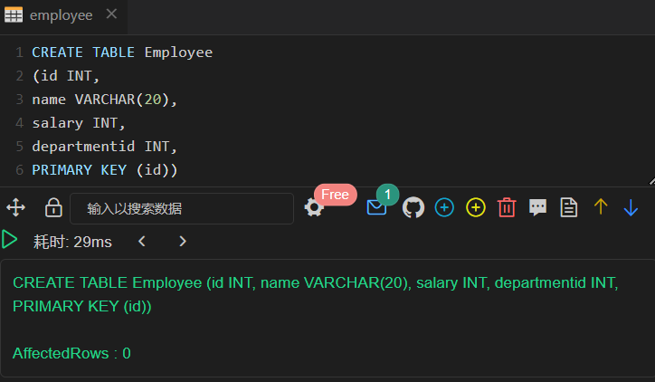
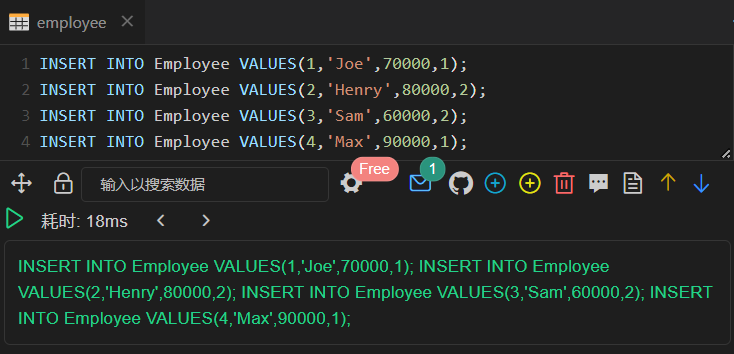
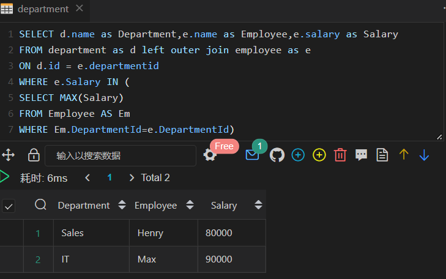
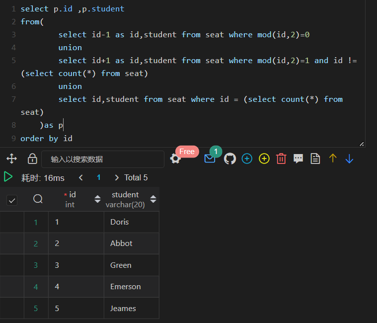
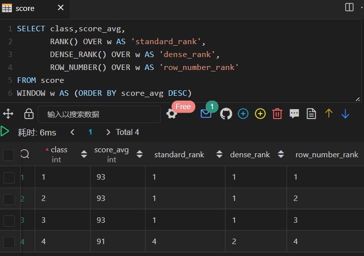
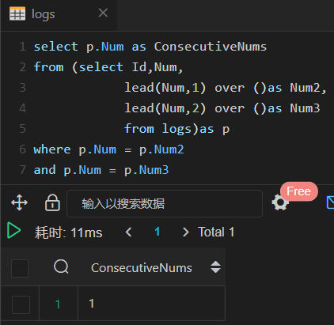
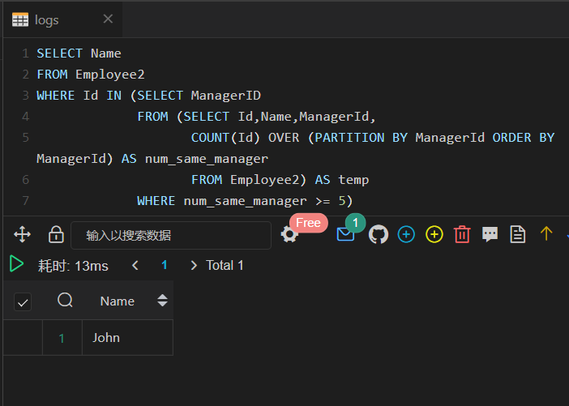

# 第六章：决胜秋招

## Section A

### 练习一: 各部门工资最高的员工（难度：中等）

创建Employee 表，包含所有员工信息，每个员工有其对应的 Id, salary 和 department Id。

```plain
+----+-------+--------+--------------+
| Id | Name  | Salary | DepartmentId |
+----+-------+--------+--------------+
| 1  | Joe   | 70000  | 1            |
| 2  | Henry | 80000  | 2            |
| 3  | Sam   | 60000  | 2            |
| 4  | Max   | 90000  | 1            |
+----+-------+--------+--------------+
```




创建Department 表，包含公司所有部门的信息。

```plain
+----+----------+
| Id | Name     |
+----+----------+
| 1  | IT       |
| 2  | Sales    |
+----+----------+
```
编写一个 SQL 查询，找出每个部门工资最高的员工。例如，根据上述给定的表格，Max 在 IT 部门有最高工资，Henry 在 Sales 部门有最高工资。
```plain
+------------+----------+--------+
| Department | Employee | Salary |
+------------+----------+--------+
| IT         | Max      | 90000  |
| Sales      | Henry    | 80000  |
+------------+----------+--------+
```



### 练习二: 换座位（难度：中等）

小美是一所中学的信息科技老师，她有一张 seat 座位表，平时用来储存学生名字和与他们相对应的座位 id。

其中纵列的**id**是连续递增的

小美想改变相邻俩学生的座位。

你能不能帮她写一个 SQL query 来输出小美想要的结果呢？

请创建如下所示seat表：

**示例：**

```plain
+---------+---------+
|    id   | student |
+---------+---------+
|    1    | Abbot   |
|    2    | Doris   |
|    3    | Emerson |
|    4    | Green   |
|    5    | Jeames  |
+---------+---------+
```
假如数据输入的是上表，则输出结果如下：
```plain
+---------+---------+
|    id   | student |
+---------+---------+
|    1    | Doris   |
|    2    | Abbot   |
|    3    | Green   |
|    4    | Emerson |
|    5    | Jeames  |
+---------+---------+
```
**注意：**
如果学生人数是奇数，则不需要改变最后一个同学的座位。




### 练习三:  分数排名（难度：中等）

假设在某次期末考试中，二年级四个班的平均成绩分别是 `93、93、93、91`，请问可以实现几种排名结果？分别使用了什么函数？排序结果是怎样的？（只考虑降序）

```plain
+-------+-----------+
| class | score_avg |
+-------+-----------+
|    1  |       93  |
|    2  |       93  |
|    3  |       93  |
|    4  |       91  |
+-------+-----------+
```



### 练习四：连续出现的数字（难度：中等）

编写一个 SQL 查询，查找所有至少连续出现三次的数字。

```plain
+----+-----+
| Id | Num |
+----+-----+
| 1  |  1  |
| 2  |  1  |
| 3  |  1  |
| 4  |  2  |
| 5  |  1  |
| 6  |  2  |
| 7  |  2  |
+----+-----+
```
例如，给定上面的 Logs 表， 1 是唯一连续出现至少三次的数字。
```plain
+-----------------+
| ConsecutiveNums |
+-----------------+
| 1               |
+-----------------+
```



### 练习六：至少有五名直接下属的经理 （难度：中等）

**Employee**表包含所有员工及其上级的信息。每位员工都有一个Id，并且还有一个对应主管的Id（ManagerId）。

```plain
+------+----------+-----------+----------+
|Id    |Name 	  |Department |ManagerId |
+------+----------+-----------+----------+
|101   |John 	  |A 	      |null      |
|102   |Dan 	  |A 	      |101       |
|103   |James 	  |A 	      |101       |
|104   |Amy 	  |A 	      |101       |
|105   |Anne 	  |A 	      |101       |
|106   |Ron 	  |B 	      |101       |
+------+----------+-----------+----------+
```
针对**Employee**表，写一条SQL语句找出**有5个下属的主管**。对于上面的表，结果应输出：

```plain
+-------+
| Name  |
+-------+
| John  |
+-------+
```
**注意:**

没有人向自己汇报。



